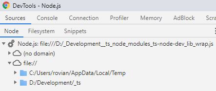

# [NodeJs API for a .NET developer](../README.md)

## 05. Debugging Node.js apps

First we add a feature usefull for debugging: in `tsconfig.json`, change `"sourceMap": true,`.
This will create .js.map files that connect the source .ts files to the emitted .js files, to allow debugging into the source files, not generated files.

Next we enable the inspection option to out our server: in `package.config`, update script `"ts:node:dev": "ts-node-dev --inspect --watch -- src/index",`

Run `npm start` as usual. You should see a message like `Debugger listening on ws://127.0.0.1 ...`

Open chrome and go to [`chrome://inspect/`](chrome://inspect/) and wait a couple of seconds for your project to appear under `remote target`.  
You can now either click on "Open dedicated DevTools for Node", or the "inspect" "in remote target".  
In the console/terminal, you should see a message `Debugger attached.`.  
In the browser window that opens, in the console, you should see the *normal* node console messages; you can debug your code just like you debug a website now.  
  
We can see our app with 2 sections:  
**no domain** contains Node's native modules used by our app (e.g. `fs.js`, `http.js`)  
**file://** contains two folders: one for our source .ts files and a temp dir where `ts-node-dev` automatically transpiles our .ts files into a .js bundle file

[Next: modules, packages, libraries](06-modules-packages-libraries.md)
