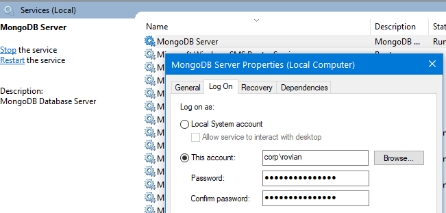

# [NodeJs API for a .NET developer](https://code.waters.com/bitbucket/users/rovian/repos/nodejs-api-for-a-.net-developer)


## 08. Mongo db

Download and install locally [MongoDB Community Server](https://www.mongodb.com/download-center/community)


If you choose to run it as service, verify it runs correctly



Could install a db management tool for it, like [Compass](https://www.mongodb.com/download-center/compass).

Install [MikroORM](https://mikro-orm.io/) and mongodb driver
`npm i -s mikro-orm mongodb`
`npm i -D @types/mongodb`

Verify/update `tsconfig.json`, make sure `"experimentalDecorators": true,` exists under `compilerOptions` section.

Add a new interface `interdace/IExpressRequest.ts` to extend `express.Request`
```typescript
import { Request } from "express";
import { EntityManager } from "mikro-orm";

export interface IExpressRequest extends Request {
	em: EntityManager;
}
```

Add new props in `env.ts` for the db
```typescript
MONGO_URL: "mongodb://127.0.0.1:27017",
DB_NAME: "a-json-db"
````

Create an entity `a-json.ts` in `mkdir src/entities`
```typescript
import { Entity, MongoEntity, SerializedPrimaryKey, PrimaryKey, Property } from "mikro-orm";
import { ObjectId } from "mongodb";

@Entity()
export class AJson implements MongoEntity<AJson> {
	@PrimaryKey()
	_id!: ObjectId;

	@SerializedPrimaryKey()
	id!: string;

	@Property()
	key1!: string;

	@Property()
	"key 2"!: string;

	constructor(model?: Partial<AJson>) {
		if (!model || !(model instanceof Object))
			model = <AJson><any>{};

		this.key1 = model.key1 || "value 1";
		this["key 2"] = model["key 2"] || "value 2";
	}
}
```

Change `app.ts`
```typescript
import { MikroORM, ReflectMetadataProvider } from "mikro-orm";
import { IExpressRequest } from "./interfaces/IExpressRequest";
import { AJson } from "./entities/a-json";

let app: express.Application;

async function makeApp(): Promise<express.Application> {
	if (app) return app;

	app = express();

	const orm = await MikroORM.init({
		metadataProvider: ReflectMetadataProvider,
		cache: { enabled: false },
		entities: [AJson],
		dbName: env.DB_NAME,
		clientUrl: env.MONGO_URL,
		type: "mongo",
		autoFlush: false
	});

	// make the entity manager available in request
	app.use((req: IExpressRequest, _res: express.Response, next: express.NextFunction) => {
		req.em = orm.em.fork();
		next();
		// or define a request context, this does the same thing "RequestContext.create(orm.em, next);"
	});
	...
}
```
The function has become async now, so its return is a promise; we need to change its usage in `index.ts`
```typescript
makeApp()
	.then(app => app.listen(env.PORT, () => log(`${env.NODE_ENV} server listening on port ${env.PORT}`)))
	.catch(err => log(err));
```
...and the test that uses it `get-discovery-client.e2e.test.ts`
```typescript
describe(`GET ${env.DISCOVERY_CLIENT_ROUTE}`, () => it("success", async () => {
	const app = await makeApp();
	supertest(app)
		.get(env.DISCOVERY_CLIENT_ROUTE)
		.expect(200, { jsonRoute: env.A_JSON_ROUTE });
}));
```

We don't want to import entities one by one in `app.ts`, so we'll do it in `src/entities/index.ts`
```typescript
import { AJson } from "./a-json";

// export "entities" array to be used with "MikroORM.init"
export default [ AJson ];
```
And change the import and usage in `app.ts`
```typescript
import entities from "./entities/";

async function makeApp(): Promise<express.Application> {
	const orm = await MikroORM.init({
		...
		entities,
		...
	});
}
```

Add [body-parser](https://github.com/expressjs/body-parser) middleware `npm i -s body-parser`, `npm i -D @types/body-parser` and use it in `app.ts`
```typescript
	...
	// middleware
	app.use(bodyParser.urlencoded({ extended: false }));
	app.use(bodyParser.json());

	// routes
	...
```

Change `a-json.service.ts`
```typescript
import { AJson } from "../entities/a-json";
import { EntityManager } from "mikro-orm";

export { getAJson, saveAJson };

async function getAJson(em: EntityManager, key1: string): Promise<Error | AJson | null> {
	if (!(em instanceof EntityManager))
		return Error("invalid request");

	if (!key1 || typeof key1 !== "string")
		return Error("invalid params");

	try {
		const aJson = await em.findOne(AJson, { key1 });
		return aJson;
	} catch (ex) {
		return ex;
	}
}

async function saveAJson(em: EntityManager, aJson: Partial<AJson>): Promise<Error | AJson> {
	if (!(em instanceof EntityManager))
		return Error("invalid request");

	if (!aJson || typeof aJson !== "object" || !aJson.key1)
		return Error("invalid params");

	try {
		const aJsonExists = await em.findOne(AJson, { key1: aJson.key1 });
		if (aJsonExists)
			return Error("item already exists");
	} catch (ex) {
		return ex;
	}

	const jsonModel = new AJson({
		key1: aJson.key1,
		"key 2": aJson["key 2"]
	});

	try {
		await em.persistAndFlush([jsonModel]);
	} catch (ex) {
		return ex;
	}

	return jsonModel;
}
```

Change `a-json.route.ts`
```typescript
import { Router, Response, NextFunction } from "express";
import { AJson } from "../entities/a-json";
import { IExpressRequest } from "../interfaces/IExpressRequest";
import * as jsonService from "../services/a-json.service";

export { setAJsonRoute };

function setAJsonRoute(router: Router): Router {
	router.get("/", getAJson);
	router.post("/", postAJson);

	return router;
}

async function getAJson(req: IExpressRequest, res: Response, next: NextFunction) {
	let aJson: Error | AJson | null;

	try {
		aJson = await jsonService.getAJson(req.em, req.query.key1);
	} catch (ex) {
		return next(ex);
	}

	if (aJson instanceof Error)
		return next(aJson);

	if (aJson === null)
		return res.status(404).end();

	return res.json(aJson);
}

async function postAJson(req: IExpressRequest, res: Response, next: NextFunction) {
	let aJson: Error | AJson;

	try {
		aJson = await jsonService.saveAJson(req.em, req.body);
	} catch (ex) {
		return next(ex);
	}

	if (aJson instanceof Error)
		return next(aJson);

	return res.status(201).json(aJson);
}
```

At this stage it's clear that we're no longer using `models` or `data` folders, so we can remove them.

Test it!
- do a post to `/api/json` with something like `{ "key1": "xxxxxxxx", "key 2": "yyyyyyy" }` => 201 (with item details)
- re-do the same post => 500 (item already exists)
- do a post with no body or with an item that has no key1 param => 500 (invalid params)
- do a get `/api/json?key1=xxxxxxxx` => 200 (with item details)
- do a get `/api/json` => 500 (invalid params)
- do a get `/api/json?key1=aaaaaa` => 404 (item not found)

It works, now let's update existing tests.


Notes:
- this is only a proof a concept, we're using either a "good" or a "bad" response, not doing proper REST.
- if you have a db manager, you could take a peek at the data saved.
- we're not using any security with our mongodb instance; for that read the [official documentation](https://docs.mongodb.com/manual/administration/security-checklist/)
- we're not "throwing" errors, we're "returning" errors


