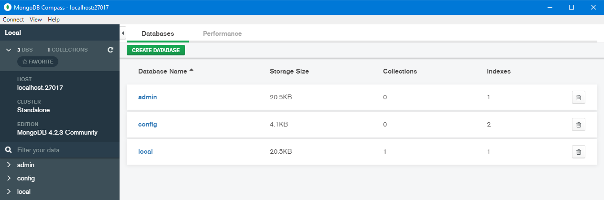

# [NodeJs API for a .NET developer](../README.md)


## 08. Mongo db

### Prerequisites

Download and install locally [MongoDB Community Server](https://www.mongodb.com/download-center/community)  
  
Could add mongo bin dir path `C:\Program Files\MongoDB\Server\4.2\bin` to env PATH, so that `mongo`, `mongod` cmd are available.  

If you choose to run it as service, verify it runs correctly  
  

Could install a db management tool for it, like [Compass](https://www.mongodb.com/download-center/compass)  
  

### Express app

Install [MikroORM](https://mikro-orm.io/) and mongodb driver `npm i -s mikro-orm mongodb`  
And the types for mongo driver module `npm i -D @types/mongodb`

Verify/update `tsconfig.json`, make sure `"experimentalDecorators": true,` exists under `compilerOptions` section.

Add new props in `env.ts` to store the db connection string and the db name to use
```typescript
MONGO_URL: "mongodb://127.0.0.1:27017",
DB_NAME: "a-json-db"
````

In `app.ts`, we need to init MikroORM and add a middleware that attaches an EntityManager to all incoming requests, so that further requests can use it automatically (note that this init can be done on demand, whenever it is required)
```typescript
import { MikroORM, ReflectMetadataProvider } from "mikro-orm";
import { AJson } from "./entities/a-json";

let app: express.Application;

async function makeApp(): Promise<express.Application> {
	if (app) return app;

	app = express();

	const orm = await MikroORM.init({
		metadataProvider: ReflectMetadataProvider,
		cache: { enabled: false },
		entities: [],
		dbName: env.DB_NAME,
		clientUrl: env.MONGO_URL,
		type: "mongo",
		autoFlush: false
	});

	// make the entity manager available in request
	app.use((req: IExpressRequest, _res: express.Response, next: express.NextFunction) => {
		req.em = orm.em.fork();
		next();
	});
	...
}
```
Noticed how `function makeApp()` became `async function makeApp()`? Its return is a promise. Because of this, we need to update how the function is used in `index.ts`
```typescript
makeApp()
	.then(app => app.listen(env.PORT, () => log(`${env.NODE_ENV} server listening on port ${env.PORT}`)))
	.catch(err => log(err));
```

If we `npm start` it now, we get a `Property 'em' does not exist on type 'Request<ParamsDictionary>'` error, so let's make an interface `src/interfaces/IExpressRequest.ts` to add the new prop:
```typescript
import { Request } from "express";
import { EntityManager } from "mikro-orm";

export interface IExpressRequest extends Request {
	em?: EntityManager;
}
```
Import it in `app.ts` and use it `req: IExpressRequest` instead of `req: express.Request`
```typescript
import { IExpressRequest } from "./interfaces/IExpressRequest";
...
app.use((req: IExpressRequest, ...
...
```
If we `npm start` it now, we get a `Error: No entities found, please use "entities" or "entitiesDirs" option` error.  
MikroORM works with special classes, decorated as `Entity`. Decorators are just functions that abstract functionality.  
We'll replace `a-json.model.ts` with an entity `src/entities/a-json.entity.ts` that will be persisted in the db
```typescript
import { Entity, MongoEntity, SerializedPrimaryKey, PrimaryKey, Property } from "mikro-orm";
import { ObjectId } from "mongodb";

@Entity()
export class AJson implements MongoEntity<AJson> {
	@PrimaryKey()
	_id!: ObjectId;

	@SerializedPrimaryKey()
	id!: string;

	@Property()
	key1!: string;

	@Property()
	"key 2"!: string;

	constructor(model?: Partial<AJson>) {
		if (!model || !(model instanceof Object))
			model = <AJson><any>{};

		this.key1 = model.key1 || "value 1";
		this["key 2"] = model["key 2"] || "value 2";
	}
}
```
The new `AJson` class contains the same props as the old `AJsonModel`, plus two required id fields (one used by mongo, the other one used by MikroORM)  
The app will probably contain a lot of these, we can roll them up in `src/entities/index.ts` easier to import:
```typescript
import { AJson } from "./a-json.entity";

// export "entities" array to be used with "MikroORM.init"
export default [ AJson ];
```
And then import the entities index and usage in `app.ts`
```typescript
import entities from "./entities/";

async function makeApp(): Promise<express.Application> {
	const orm = await MikroORM.init({
		...
		entities,
		...
	});
}
```

Now the app starts again, but we're not using the db at all. Let's change `/api/ajson` route to accept GET and POST requests, to read/write from db.  
Add [body-parser](https://github.com/expressjs/body-parser) middleware `npm i -s body-parser`, `npm i -D @types/body-parser` and use it in `app.ts`
```typescript
import * as bodyParser from "body-parser";
...
// middleware
app.use(bodyParser.urlencoded({ extended: false }));
app.use(bodyParser.json());

// routes
...
```

Change `a-json.service.ts`
```typescript
import { AJson } from "../entities/a-json.entity";
import { EntityManager } from "mikro-orm";

export { getAJson, saveAJson };

async function getAJson(em: EntityManager, key1: string): Promise<Error | AJson | null> {
	if (!(em instanceof EntityManager))
		return Error("invalid request");

	if (!key1 || typeof key1 !== "string")
		return Error("invalid params");

	try {
		const aJson = await em.findOne(AJson, { key1 });
		return aJson;
	} catch (ex) {
		return ex;
	}
}

async function saveAJson(em: EntityManager, aJson: Partial<AJson>): Promise<Error | AJson> {
	if (!(em instanceof EntityManager))
		return Error("invalid request");

	if (!aJson || typeof aJson !== "object" || !aJson.key1)
		return Error("invalid params");

	try {
		const aJsonExists = await em.findOne(AJson, { key1: aJson.key1 });
		if (aJsonExists)
			return Error("item already exists");
	} catch (ex) {
		return ex;
	}

	const jsonModel = new AJson({
		key1: aJson.key1,
		"key 2": aJson["key 2"]
	});

	try {
		await em.persistAndFlush([jsonModel]);
	} catch (ex) {
		return ex;
	}

	return jsonModel;
}
```

Change `a-json.route.ts`
```typescript
import { Router, Response, NextFunction } from "express";
import { EntityManager } from "mikro-orm";
import { AJson } from "../entities/a-json.entity";
import { IExpressRequest } from "../interfaces/IExpressRequest";
import * as jsonService from "../services/a-json.service";

export { setAJsonRoute };

function setAJsonRoute(router: Router): Router {
	router.get("/", getAJson);
	router.post("/", postAJson);

	return router;
}

async function getAJson(req: IExpressRequest, res: Response, next: NextFunction) {
	if (!req.em || !(req.em instanceof EntityManager))
		return next(Error("EntityManager not available"));

	let aJson: Error | AJson | null;
	try {
		aJson = await jsonService.getAJson(req.em, req.query.key1);
	} catch (ex) {
		return next(ex);
	}

	if (aJson instanceof Error)
		return next(aJson);

	if (aJson === null)
		return res.status(404).end();

	return res.json(aJson);
}

async function postAJson(req: IExpressRequest, res: Response, next: NextFunction) {
	if (!req.em || !(req.em instanceof EntityManager))
		return next(Error("EntityManager not available"));

	let aJson: Error | AJson;
	try {
		aJson = await jsonService.saveAJson(req.em, req.body);
	} catch (ex) {
		return next(ex);
	}

	if (aJson instanceof Error)
		return next(aJson);

	return res.status(201).json(aJson);
}
```

At this stage it's clear that we're no longer using `models` or `data` folders, so we can remove them.

Try it!
- `curl -X POST -iH "Content-Type: application/json" -d "{\"key1\":\"xxxxxxxx\"}" http://localhost/api/json` => **201** (with item details)  
- `curl -X POST -iH "Content-Type: application/json" -d "{\"key1\":\"xxxxxxxx\"}" http://localhost/api/json` => **500** (item already exists)  
- `curl -X POST -iH "Content-Type: application/json" http://localhost/api/json                             ` => **500** (invalid params)  
- `curl -i http://localhost/api/json?key1=xxxxxxxx` => **200** (with item details)  
- `curl -i http://localhost/api/json              ` => **500** (invalid params)  
- `curl -i http://localhost/api/json?key1=aaaaaa  ` => **404** (item not found)  


It works, but do the existing tests still run? Run `npm test`...they don't! We modified `a-json.route` so no wonder.  
The test must be updated to mock the EntityManager, because we don't want to read/write from the db.  
Also, the GET route has 5 exit points that have to be tested, and the POST has 4 exit points.

First, update `express-router-test.helper.ts` to use `IExpressRequest` instead of `Request`, add a `post` mocker and add a `end` method to response mock:
```typescript
import { Router, Response, NextFunction } from "express";
import { IExpressRequest } from "../src/interfaces/IExpressRequest";
...
function getRouterMock() {
	...
	const router = <Router><any>{
		get: (path: string, cb: (req: IExpressRequest, res: Response, next: NextFunction) => any) => addRoute("GET", path, cb),
		post: (path: string, cb: (req: IExpressRequest, res: Response, next: NextFunction) => any) => addRoute("POST", path, cb)
	};
	...
}
...
function getResponseSpyMock(): Response {
	...
	const end = (): Response => res;
	res.end = end;
	spyOn(res, <any>res.end.name).and.callThrough();
	...
}
```
Then replace `a-json.route.test.ts` with the new content:
```typescript
import { Router } from "express";
import { noCallThru } from "proxyquire";
import { getRouterMock, getResponseSpyMock, getNextFunctionSpyMock } from "../../test/express-router-test.helper";
import { IExpressRequest } from "../interfaces/IExpressRequest";

const proxyquire = noCallThru();

describe("a-json.route", () => {
	// import the file under test and mock its dependencies

	// prepare the exports object of the mocked dependency
	// this is empty now because it will be asigned different values per test
	const aJsonService: { getAJson(): { [key: string]: string } | Error | null } = <any>{};

	class EntityManager { }

	const aJsonRoute: { setAJsonRoute(router: Router): Router } = proxyquire(
		"./a-json.route",
		{
			"mikro-orm": { EntityManager },
			"../services/a-json.service": aJsonService
		}
	);

	const { router, routes } = getRouterMock();

	// build router; the routes will now contain all paths and their callbacks
	// all we have to do now is call the callbacks with the desired params to test behaviour
	beforeAll(() => aJsonRoute.setAJsonRoute(router));

	it("setAJsonRoute - router setup", () => {
		expect(routes["GET"]["/"]).toBeDefined("route GET / not setup");
		expect(typeof routes["GET"]["/"]).toBe("function", "route GET / not a function");
		expect(routes["POST"]["/"]).toBeDefined("route POST / not setup");
		expect(typeof routes["POST"]["/"]).toBe("function", "route POST / not a function");
	});

	it("setAJsonRoute - GET / - exit point 1", async () => {
		const req = <IExpressRequest>{};
		const next = getNextFunctionSpyMock();

		await routes["GET"]["/"](req, undefined, next);

		expect(next).toHaveBeenCalledWith(Error("EntityManager not available"));
	});
	it("setAJsonRoute - GET / - exit point 2", async () => {
		const err = Error("service mock error");
		const req = <IExpressRequest>{
			em: new EntityManager(),
			query: {}
		};
		const next = getNextFunctionSpyMock();
		aJsonService.getAJson = () => { throw err; };

		await routes["GET"]["/"](req, undefined, next);

		expect(next).toHaveBeenCalledWith(err);
	});
	it("setAJsonRoute - GET / - exit point 3", async () => {
		const err = Error("service mock error");
		const req = <IExpressRequest>{
			em: new EntityManager(),
			query: {}
		};
		const next = getNextFunctionSpyMock();
		aJsonService.getAJson = () => err;

		await routes["GET"]["/"](req, undefined, next);

		expect(next).toHaveBeenCalledWith(err);
	});
	it("setAJsonRoute - GET / - exit point 4", async () => {
		const req = <IExpressRequest>{
			em: new EntityManager(),
			query: {}
		};
		const res = getResponseSpyMock();
		aJsonService.getAJson = () => null;

		await routes["GET"]["/"](req, res, undefined);

		expect(res.status).toHaveBeenCalledWith(404);
		expect(res.end).toHaveBeenCalled();
	});
	it("setAJsonRoute - GET / - exit point 5", async () => {
		const req = <IExpressRequest>{
			em: new EntityManager(),
			query: {}
		};
		const res = getResponseSpyMock();
		const json = { mockKey: "mock value" };
		aJsonService.getAJson = () => json;

		await routes["GET"]["/"](req, res, null);

		expect(res.json).toHaveBeenCalledWith(json);
	});

	xit("setAJsonRoute - POST / - exit point 1", async () => expect(undefined).toBeDefined("NOT IMPLEMENTED"));
	xit("setAJsonRoute - POST / - exit point 2", async () => expect(undefined).toBeDefined("NOT IMPLEMENTED"));
	xit("setAJsonRoute - POST / - exit point 3", async () => expect(undefined).toBeDefined("NOT IMPLEMENTED"));
	xit("setAJsonRoute - POST / - exit point 4", async () => expect(undefined).toBeDefined("NOT IMPLEMENTED"));
});
```
I have added the complete unit tests for GET route, you add the same for the 4 exit points of the POST route.


Finally, running the complete test suite with `npm test` reveals that `get-discovery-client.e2e.test.ts` fails because we did not update it after making `makeApp` a promise, so this needs updated too
```typescript
describe(`GET ${env.DISCOVERY_CLIENT_ROUTE}`, () => it("success", async () => {
	const app = await makeApp();
	supertest(app)
		.get(env.DISCOVERY_CLIENT_ROUTE)
		.expect(200, { jsonRoute: env.A_JSON_ROUTE });
}));
```
Now we're done!


Notes:
- this is only a proof a concept, we're using either a "good" or a "bad" response, not doing proper REST.
- if you have a db manager, you could take a peek at the data saved.
- we're not using any security with our mongodb instance; for that read the [official documentation](https://docs.mongodb.com/manual/administration/security-checklist/)
- we're not "throwing" errors, we're "returning" errors
- there is another "acceptance" testing layer, which tests an app just like a normal user would 
and this involves writing test cases in human readable form
and bind that to an implementation that tests a production like environment.
This is way beyond the scope of this presentation, for this there is [cucumber.js](https://github.com/cucumber/cucumber-js).
It is as simple as `jasmine` is, just take a look at the [demo](http://cucumber.github.io/cucumber-js/).
